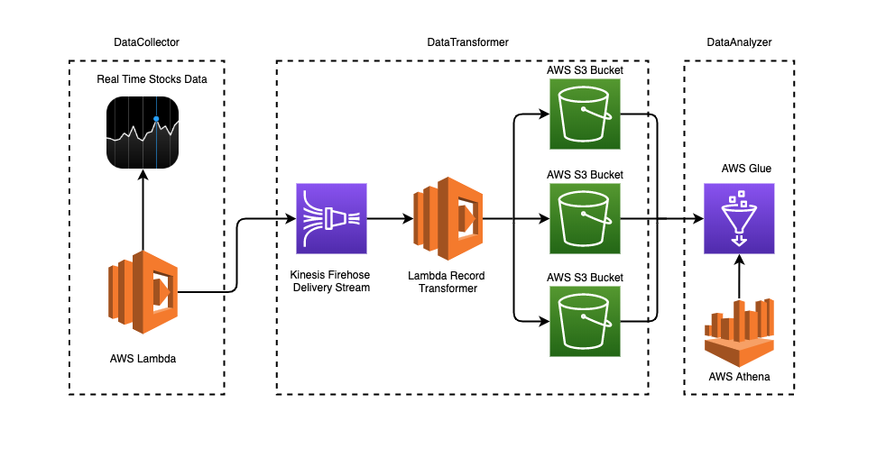

# Streaming Finance Data with AWS Lambda

This project was completed under the guidance of Professor Taq. 

For this project, we will provision a few Lambda functions to generate near real time finance data records for downstream processing and interactive querying. We begin by creating a **AWS Kinesis Firehose Delivery Stream** ("finance-delivery-stream"). This stream has a lambda function (which I named "finance-transformer") that transforms our record and streams it into an **AWS S3 Bucket** bucket. Next, we wrote another Lambda function (which I named "finance-collector"). On trigger, it grabs stock price data and places it into the delivery defined in the transformer. Finally, we configured **AWS Glue**, pointing it to the **AWS S3 Bucket** created in the transformer. Essentially, this allows us to interactively query the **S3** files generated by the transformer using **AWS Athena** to gain insight into our streamed data. Following is a diagram depicting a macro overview:



As you can see from this diagram, on the left side we have a Lambda function that can programmatically pull data in from some internet source (more on that in the next section). On the right side we have AWS Athena, which allows us to write ad-hoc, interactive queries against the data we have accumulated to gain various types of insights.

If our left hand, DataCollector lambda were to run every hour, we would have a system that manages and stores realtime data and allows querying of that data in near real time (this would alter costs).
____________________________________________________________________________________________________________________________
## Prerequisite
In our collector lambda ("finance-collector"), using the [yfinance](https://pypi.org/project/yfinance/) module ([documentaion](https://github.com/ranaroussi/yfinance) here), we grab **one full day’s worth of stock HIGH and LOW pricing** information for each of the following stocks for **Thursday, May 14th 2020, at one minute intervals**:

* Facebook (FB)
* Shopify (SHOP)
* Beyond Meat (BYND)
* Netflix (NFLX)
* Pinterest (PINS)
* Square (SQ)
* The Trade Desk (TTD)
* Okta (OKTA)
* Snap (SNAP)
* Datadog (DDOG)

Generally, in order to write a lambda function with pip requirements as we are used to, we must create and upload what is called a deployment artifact. Creating such an artifact requires working in the terminal, which is fine but for the sake of simplicity we will avoid the terminal. 

For this reason we will be providing a work-around to ensure that our lambda can be written without having to create and upload a deployment package via the terminal. In order to make our project work with just the AWS lambda homepage provided code editor, we copy and paste the snippet of code below into our **Collector lambda function**.

```python
import boto3
import os
import subprocess
import sys

subprocess.check_call([sys.executable, "-m", "pip", "install", "--target",
"/tmp", 'yfinance'])
sys.path.append('/tmp')
import yfinance
```
____________________________________________________________________________________________________________________________
## Data Collector

### Lambda function URL
* **API Endpoint:** https://l60n6vvw3i.execute-api.us-east-2.amazonaws.com/default/finance-collector

### Lambda function source code
* ``` data_collector.py ```

```python

LAMBDA COLLECTOR SOURCE CODE HERE AND UPLOAD data_collector.py FILE IN ROOT
```

**Following is a screenshot of my AWS Lambda configuration page illustrating that the collector function ran successfully.**

____________________________________________________________________________________________________________________________
## Data Transformer
### Lambda function source code
* ``` data_transformer.py ```

```python
```
**Following is a screenshot of the kinesis firehose delivery stream “Monitoring” page, showcasing graphs that prove firehose was used.**\

____________________________________________________________________________________________________________________________

## Data Analyzer
* Following ```query.sql``` was run in order to acheive the highest stock price per trading hour.
```SQL
SQL QUERY HERE
```
* This is a tabulated representation for the output of above query, the actual ```results.csv``` may be found in the root directory.

| Company_Name | Hour_Of_Day | Date_Time_Of_When_High_Price_Occurred | High_Stock_Price   | 
|--------------|-------------|---------------------------------------|--------------------| 
| BYND         | 9           | 2020-05-14 09:39:00-04:00             | 137.97000122070300 | 
| BYND         | 10          | 2020-05-14 10:31:00-04:00             | 139.55999755859400 | 
| BYND         | 11          | 2020-05-14 11:15:00-04:00             | 141.0              | 
| BYND         | 12          | 2020-05-14 12:57:00-04:00             | 138.24000549316400 | 
| BYND         | 13          | 2020-05-14 13:00:00-04:00             | 137.78990173339800 | 
| BYND         | 14          | 2020-05-14 14:12:00-04:00             | 135.7301025390630  | 
| BYND         | 15          | 2020-05-14 15:54:00-04:00             | 135.85000610351600 | 
| DDOG         | 9           | 2020-05-14 09:32:00-04:00             | 67.25              | 
| DDOG         | 10          | 2020-05-14 10:09:00-04:00             | 66.55000305175780  | 
| DDOG         | 11          | 2020-05-14 11:20:00-04:00             | 65.0               | 
| DDOG         | 11          | 2020-05-14 11:16:00-04:00             | 65.0               | 
| DDOG         | 11          | 2020-05-14 11:06:00-04:00             | 65.0               | 
| DDOG         | 11          | 2020-05-14 11:05:00-04:00             | 65.0               | 
| DDOG         | 12          | 2020-05-14 12:54:00-04:00             | 64.87999725341800  | 
| DDOG         | 13          | 2020-05-14 13:02:00-04:00             | 65.0               | 
| DDOG         | 14          | 2020-05-14 14:48:00-04:00             | 64.12999725341800  | 
| DDOG         | 15          | 2020-05-14 15:54:00-04:00             | 65.86990356445310  | 
| FB           | 9           | 2020-05-14 09:37:00-04:00             | 203.8677978515630  | 
| FB           | 10          | 2020-05-14 10:53:00-04:00             | 203.35000610351600 | 
| FB           | 11          | 2020-05-14 11:37:00-04:00             | 204.27000427246100 | 
| FB           | 12          | 2020-05-14 12:56:00-04:00             | 205.10000610351600 | 
| FB           | 13          | 2020-05-14 13:32:00-04:00             | 205.63999938964800 | 
| FB           | 14          | 2020-05-14 14:29:00-04:00             | 204.98500061035200 | 
| FB           | 15          | 2020-05-14 15:59:00-04:00             | 206.92999267578100 | 
| NFLX         | 9           | 2020-05-14 09:36:00-04:00             | 452.0              | 
| NFLX         | 10          | 2020-05-14 10:08:00-04:00             | 446.510009765625   | 
| NFLX         | 11          | 2020-05-14 11:16:00-04:00             | 440.6400146484380  | 
| NFLX         | 12          | 2020-05-14 12:59:00-04:00             | 440.3399963378910  | 
| NFLX         | 13          | 2020-05-14 13:49:00-04:00             | 441.7799987792970  | 
| NFLX         | 14          | 2020-05-14 14:30:00-04:00             | 441.44000244140600 | 
| NFLX         | 15          | 2020-05-14 15:59:00-04:00             | 442.1400146484380  | 
| OKTA         | 9           | 2020-05-14 09:38:00-04:00             | 178.0              | 
| OKTA         | 9           | 2020-05-14 09:39:00-04:00             | 178.0              | 
| OKTA         | 10          | 2020-05-14 10:10:00-04:00             | 177.80679321289100 | 
| OKTA         | 11          | 2020-05-14 11:37:00-04:00             | 179.88999938964800 | 
| OKTA         | 12          | 2020-05-14 12:57:00-04:00             | 179.0050048828130  | 
| OKTA         | 13          | 2020-05-14 13:02:00-04:00             | 178.5              | 
| OKTA         | 13          | 2020-05-14 13:03:00-04:00             | 178.5              | 
| OKTA         | 14          | 2020-05-14 14:32:00-04:00             | 177.80999755859400 | 
| OKTA         | 15          | 2020-05-14 15:05:00-04:00             | 177.85000610351600 | 
| PINS         | 9           | 2020-05-14 09:31:00-04:00             | 16.540000915527300 | 
| PINS         | 9           | 2020-05-14 09:32:00-04:00             | 16.540000915527300 | 
| PINS         | 10          | 2020-05-14 10:54:00-04:00             | 16.674999237060500 | 
| PINS         | 10          | 2020-05-14 10:53:00-04:00             | 16.674999237060500 | 
| PINS         | 11          | 2020-05-14 11:18:00-04:00             | 16.94499969482420  | 
| PINS         | 12          | 2020-05-14 12:57:00-04:00             | 17.040000915527300 | 
| PINS         | 13          | 2020-05-14 13:26:00-04:00             | 17.030000686645500 | 
| PINS         | 14          | 2020-05-14 14:21:00-04:00             | 16.905000686645500 | 
| PINS         | 14          | 2020-05-14 14:22:00-04:00             | 16.905000686645500 | 
| PINS         | 15          | 2020-05-14 15:51:00-04:00             | 17.09000015258790  | 
| PINS         | 15          | 2020-05-14 15:50:00-04:00             | 17.09000015258790  | 
| SHOP         | 9           | 2020-05-14 09:31:00-04:00             | 758.0900268554690  | 
| SHOP         | 10          | 2020-05-14 10:12:00-04:00             | 752.0              | 
| SHOP         | 10          | 2020-05-14 10:10:00-04:00             | 752.0              | 
| SHOP         | 11          | 2020-05-14 11:16:00-04:00             | 757.469970703125   | 
| SHOP         | 12          | 2020-05-14 12:57:00-04:00             | 754.1599731445310  | 
| SHOP         | 13          | 2020-05-14 13:01:00-04:00             | 755.8200073242190  | 
| SHOP         | 14          | 2020-05-14 14:57:00-04:00             | 751.7999877929690  | 
| SHOP         | 15          | 2020-05-14 15:50:00-04:00             | 755.5700073242190  | 
| SNAP         | 9           | 2020-05-14 09:31:00-04:00             | 16.729999542236300 | 
| SNAP         | 10          | 2020-05-14 10:54:00-04:00             | 16.93000030517580  | 
| SNAP         | 11          | 2020-05-14 11:07:00-04:00             | 17.149999618530300 | 
| SNAP         | 12          | 2020-05-14 12:57:00-04:00             | 16.989999771118200 | 
| SNAP         | 13          | 2020-05-14 13:31:00-04:00             | 17.0               | 
| SNAP         | 14          | 2020-05-14 14:57:00-04:00             | 16.920000076293900 | 
| SNAP         | 14          | 2020-05-14 14:58:00-04:00             | 16.920000076293900 | 
| SNAP         | 15          | 2020-05-14 15:08:00-04:00             | 16.969999313354500 | 
| SNAP         | 15          | 2020-05-14 15:09:00-04:00             | 16.969999313354500 | 
| SQ           | 9           | 2020-05-14 09:46:00-04:00             | 72.80999755859380  | 
| SQ           | 10          | 2020-05-14 10:59:00-04:00             | 75.58999633789060  | 
| SQ           | 11          | 2020-05-14 11:09:00-04:00             | 76.48999786376950  | 
| SQ           | 12          | 2020-05-14 12:59:00-04:00             | 76.75              | 
| SQ           | 13          | 2020-05-14 13:48:00-04:00             | 77.18000030517580  | 
| SQ           | 14          | 2020-05-14 14:59:00-04:00             | 77.26000213623050  | 
| SQ           | 15          | 2020-05-14 15:57:00-04:00             | 78.25              | 
| TTD          | 9           | 2020-05-14 09:31:00-04:00             | 289.44989013671900 | 
| TTD          | 10          | 2020-05-14 10:53:00-04:00             | 290.07000732421900 | 
| TTD          | 11          | 2020-05-14 11:18:00-04:00             | 296.8562927246090  | 
| TTD          | 12          | 2020-05-14 12:57:00-04:00             | 294.5              | 
| TTD          | 13          | 2020-05-14 13:31:00-04:00             | 296.0              | 
| TTD          | 14          | 2020-05-14 14:59:00-04:00             | 295.7699890136720  | 
| TTD          | 15          | 2020-05-14 15:24:00-04:00             | 297.6700134277340  | 
